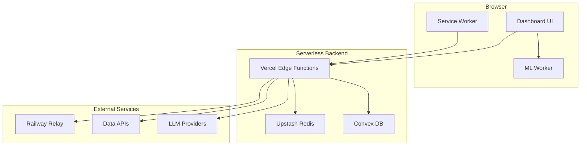
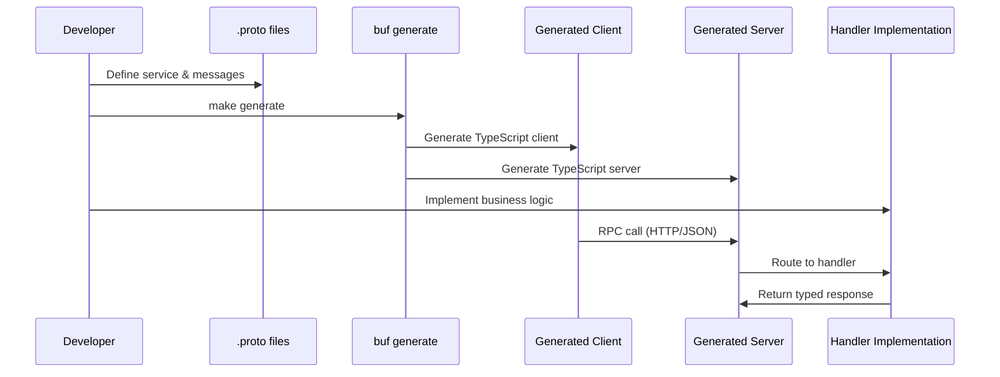
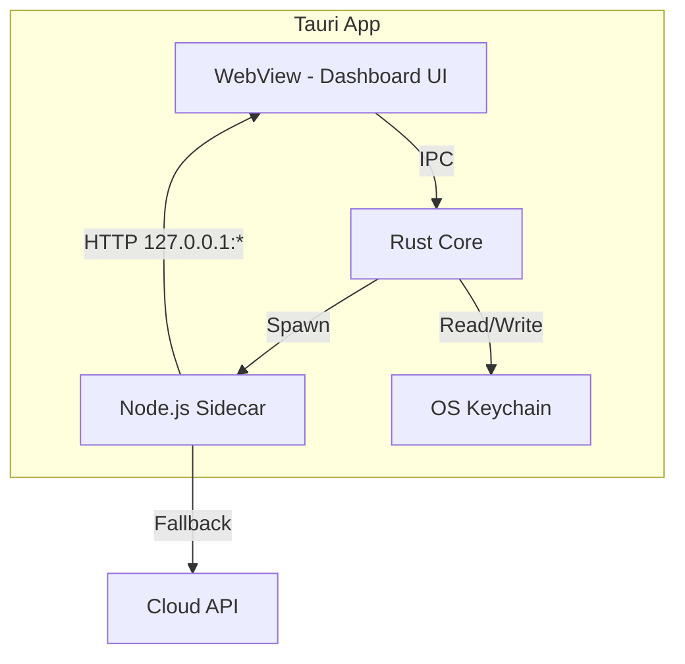
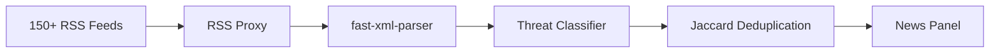
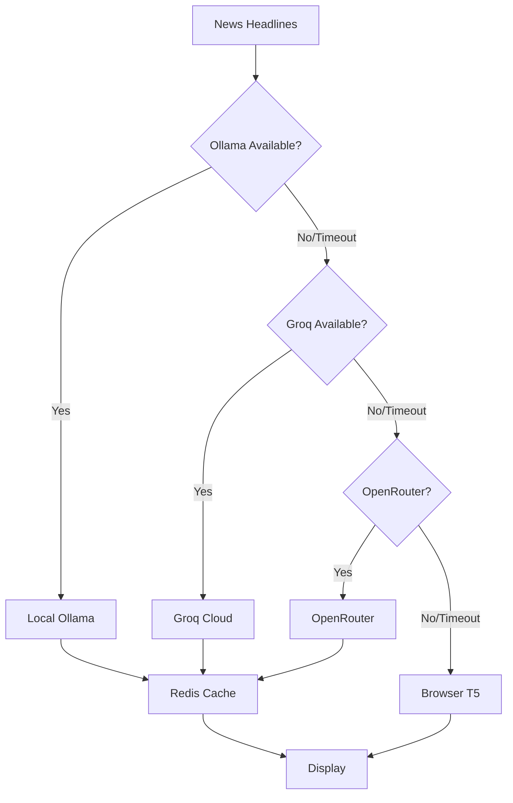
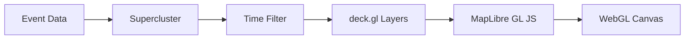

## Tech Stack

### Frontend

| Technology | Purpose | Version |
| --- | --- | --- |
| **TypeScript** | Type-safe JavaScript | 5.7.2 |
| **Vite** | Build tool and dev server | 6.0.7 |
| **MapLibre GL JS** | 2D/3D map rendering | 5.16.0 |
| **deck.gl** | WebGL data visualization | 9.2.6 |
| **D3.js** | Charts and data transformations | 7.9.0 |
| **i18next** | Internationalization (16 languages) | 25.8.10 |
| **Vite PWA** | Progressive web app features | 1.2.0 |

### Backend (Serverless)

| Technology | Purpose |
| --- | --- |
| **Vercel Edge Functions** | Serverless API routes |
| **Node.js** | Server runtime |
| **Sebuf** | TypeScript RPC framework |
| **Upstash Redis** | Distributed cache and rate limiting |
| **Convex** | Real-time database for registrations |

### Desktop (Tauri)

| Technology | Purpose | Version |
| --- | --- | --- |
| **Tauri** | Native app framework | 2.10.0 |
| **Rust** | Backend runtime | — |
| **Node.js Sidecar** | Local API server | 18+ |

### AI & ML

| Technology | Purpose |
| --- | --- |
| **Transformers.js** | Browser-side ML (NER, sentiment) | 2.17.2 |
| **ONNX Runtime Web** | Neural network inference | 1.23.2 |
| **Ollama** | Local LLM inference | — |
| **Groq** | Cloud LLM inference (Llama 3.1 8B) | — |
| **OpenRouter** | Multi-model LLM gateway | — |

### Data Processing

| Technology | Purpose |
| --- | --- |
| **PapaParse** | CSV parsing | 5.5.3 |
| **fast-xml-parser** | XML/RSS parsing | 5.3.7 |
| **topojson-client** | TopoJSON mesh rendering | 3.1.0 |
| **h3-js** | Hexagonal spatial indexing | 4.4.0 |

### Protobuf Tooling

| Tool | Purpose | Version |
| --- | --- | --- |
| **buf** | Proto linting and generation | 1.64.0 |
| **sebuf** | TypeScript RPC code generator | 0.7.0 |
| **protoc-gen-ts-client** | Client stub generator | — |
| **protoc-gen-ts-server** | Server handler generator | — |
| **protoc-gen-openapiv3** | OpenAPI spec generator | — |

## System Architecture

### High-Level Design



### Proto-First API Flow



### Desktop Architecture



## Project Structure

```
worldmonitor/
├── api/                          # Vercel serverless functions
│   ├── [domain]/v1/[rpc].ts     # Sebuf RPC gateway catch-all
│   ├── download.ts              # Desktop installer redirect
│   └── og-story.ts              # Dynamic Open Graph images
├── convex/                       # Convex database schema
├── data/                         # Static datasets (GeoJSON, CSV)
├── deploy/                       # Deployment configs
├── docs/                         # Documentation source
│   └── api/                     # Generated OpenAPI specs
├── e2e/                         # Playwright E2E tests
├── proto/                       # Protocol buffer definitions
│   ├── buf.gen.yaml             # Code generation config
│   ├── sebuf/                   # Sebuf framework protos
│   └── worldmonitor/            # Service definitions (20 domains)
│       ├── aviation/v1/
│       ├── climate/v1/
│       ├── conflict/v1/
│       ├── cyber/v1/
│       ├── seismology/v1/
│       └── ...
├── public/                      # Static assets
├── scripts/                     # Build and utility scripts
│   ├── build-sidecar-sebuf.mjs # Bundle sidecar gateway
│   ├── desktop-package.mjs     # Package desktop builds
│   ├── ais-relay.cjs           # Railway relay server
│   └── ...
├── server/                      # Server-side handler implementations
│   ├── router.ts               # HTTP route matcher
│   ├── cors.ts                 # CORS policy
│   ├── error-mapper.ts         # Error response formatter
│   └── worldmonitor/           # Handler implementations
│       ├── seismology/v1/handler.ts
│       ├── aviation/v1/handler.ts
│       └── ...
├── src/                         # Frontend source code
│   ├── App.ts                  # Main application entry
│   ├── main.ts                 # Vite entry point
│   ├── components/             # UI components (panels, modals)
│   ├── services/               # Data fetching services
│   ├── utils/                  # Helper functions
│   ├── config/                 # Configuration files
│   ├── locales/                # i18n translation files (16 languages)
│   ├── workers/                # Web Workers (ML inference)
│   ├── generated/              # Generated code (DO NOT EDIT)
│   │   ├── client/             # TypeScript RPC clients
│   │   └── server/             # TypeScript RPC servers
│   └── styles/                 # Global CSS
├── src-tauri/                   # Tauri desktop app
│   ├── src/                    # Rust source code
│   ├── sidecar/                # Node.js sidecar server
│   └── tauri.conf.json         # Tauri configuration
├── tests/                       # Unit and API tests
├── vite.config.ts              # Vite build configuration
├── playwright.config.ts        # Playwright test configuration
├── tsconfig.json               # TypeScript configuration
├── Makefile                    # Development commands
└── package.json                # npm scripts and dependencies
```

## Key Directories Explained

### `/proto`

Contains all protocol buffer definitions organized by domain:

- **20 service domains**: aviation, climate, conflict, cyber, displacement, economic, giving, infrastructure, intelligence, maritime, market, military, news, positive_events, prediction, research, seismology, supply_chain, trade
- **buf.gen.yaml**: Configures code generation plugins
- **buf.yaml**: Proto linting rules and dependencies

### `/src/generated`

**WARNING: Never edit files here manually.** This directory is regenerated by `make generate`.

- **client/**: TypeScript RPC clients for frontend use
- **server/**: TypeScript server stubs for backend handlers

Both are auto-generated from proto definitions.

### `/server`

Server-side handler implementations that fulfill the generated service interfaces:

```typescript
// Example: server/worldmonitor/seismology/v1/handler.ts
export const seismologyHandler: SeismologyService = {
  async listEarthquakes(req, context) {
    // Fetch from USGS API
    // Transform to proto response
    return { earthquakes };
  },
};
```

### `/api`

Vercel serverless functions. Most routes are handled by the catch-all:

```
/api/[domain]/v1/[rpc].ts
```

This single file routes all RPC requests to their respective handlers.

### `/scripts`

Build and utility scripts:

- **build-sidecar-sebuf.mjs**: Bundles the sidecar gateway for Tauri
- **desktop-package.mjs**: Creates signed installers for macOS/Windows
- **ais-relay.cjs**: Railway relay server for AIS/OpenSky/Telegram
- **validate-rss-feeds.mjs**: Tests all RSS feed URLs

### `/e2e`

Playwright end-to-end tests:

- **runtime-fetch.spec.ts**: Tests all API endpoints across variants
- **map-harness.spec.ts**: Visual regression tests for map layers
- **circuit-breaker-persistence.spec.ts**: Circuit breaker behavior
- **keyword-spike-flow.spec.ts**: Keyword spike detection

## Build Variants

World Monitor supports 4 build variants from a single codebase:

| Variant | Domain | Focus | Data Layers |
| --- | --- | --- | --- |
| **Full** | worldmonitor.app | Geopolitics, military, conflicts | 40+ layers |
| **Tech** | tech.worldmonitor.app | AI/ML, startups, cloud | Tech-specific |
| **Finance** | finance.worldmonitor.app | Markets, trading, central banks | Financial centers, exchanges |
| **Happy** | happy.worldmonitor.app | Good news, positive trends | Uplifting stories |

Variants are controlled by the `VITE_VARIANT` environment variable.

## Data Flow

### News Aggregation



### AI Summarization



### Map Rendering Pipeline



## Configuration Files

### vite.config.ts

Configures:
- Build variants with dynamic HTML meta injection
- Brotli pre-compression
- Service worker registration (PWA)
- Dev server plugins (sebuf, RSS proxy, Polymarket, YouTube)
- Chunk splitting strategy

### playwright.config.ts

Configures:
- Test directory: `./e2e`
- Base URL: `http://127.0.0.1:4173`
- Browser: Chromium with SwiftShader (headless GPU)
- Retries: 0 (fail fast)
- Workers: 1 (serial execution)

### tsconfig.json

TypeScript settings:
- Target: ES2020
- Module: ESNext
- Strict mode enabled
- Path alias: `@/*` → `src/*`

### Makefile

Development commands:
- `make install` — Install all dependencies
- `make generate` — Generate code from protos
- `make lint` — Lint proto files
- `make clean` — Remove generated code

## Next Steps

<CardGroup cols={2}>
  <Card title="Proto API" icon="code" href="/development/proto-api">
    Learn the proto-first workflow
  </Card>
  <Card title="Building" icon="hammer" href="/development/building">
    Build for production and desktop
  </Card>
</CardGroup>
