## What is World Monitor?

World Monitor is a **real-time global intelligence dashboard** that aggregates news, geopolitical data, military activity, infrastructure monitoring, and market intelligence into a unified situational awareness interface.

Built with TypeScript, Vite, and WebGL-accelerated mapping (deck.gl + MapLibre GL), World Monitor delivers:

- **100+ curated news feeds** with AI-synthesized briefs
- **40+ interactive data layers** on a 3D globe (conflicts, bases, cables, satellites)
- **Local-first AI** with Ollama/LM Studio support — no API keys required
- **Native desktop apps** for macOS, Windows, and Linux
- **Four specialized variants**: Geopolitical, Tech, Finance, and Happy News

<CardGroup cols={2}>
  <Card
    title="Quick Start"
    icon="rocket"
    href="/quickstart"
  >
    Get World Monitor running in 5 minutes
  </Card>
  <Card
    title="Installation"
    icon="download"
    href="/installation"
  >
    Detailed setup for web and desktop
  </Card>
  <Card
    title="Interactive Globe"
    icon="globe"
    href="/features/interactive-globe"
  >
    Explore the 3D WebGL map with 40+ layers
  </Card>
  <Card
    title="AI Intelligence"
    icon="brain"
    href="/features/ai-intelligence"
  >
    AI-powered briefs and threat classification
  </Card>
</CardGroup>

## Why World Monitor?

<AccordionGroup>
  <Accordion title="Unified Intelligence" icon="layer-group">
    Replace 20+ browser tabs with a single dashboard that aggregates:
    - News from 150+ RSS feeds (BBC, Reuters, Al Jazeera, defense publications)
    - Real-time military flight and naval vessel tracking
    - Conflict zones, protests, and natural disasters
    - Infrastructure (undersea cables, pipelines, datacenters)
    - Market data and prediction markets
  </Accordion>

  <Accordion title="100% Free & Open Source" icon="code">
    - Licensed under **AGPL-3.0**
    - No paywalls or usage limits
    - Self-host on your own infrastructure
    - All data sources are public or user-provided API keys
  </Accordion>

  <Accordion title="Privacy-First AI" icon="shield">
    Run AI summarization entirely on local hardware:
    - **Ollama** and **LM Studio** integration
    - No API keys required for local models
    - No data leaves your machine
    - Fallback to cloud LLMs (Groq, OpenRouter) is optional
  </Accordion>

  <Accordion title="Native Desktop Apps" icon="desktop">
    Tauri-based desktop applications for:
    - **macOS** (Apple Silicon and Intel)
    - **Windows** (.exe and .msi installers)
    - **Linux** (AppImage)
    
    Features:
    - OS keychain integration for secrets
    - Local API sidecar (Node.js) runs 60+ API handlers
    - Cloud fallback when local handlers fail
  </Accordion>
</AccordionGroup>

## Key Features

<CardGroup cols={3}>
  <Card title="150+ News Feeds" icon="newspaper">
    Curated RSS feeds from geopolitical, defense, tech, and finance sources with AI-powered clustering and entity extraction.
  </Card>
  
  <Card title="40+ Data Layers" icon="layer-group">
    Toggle between conflicts, military bases, undersea cables, satellite fires, protests, and more on an interactive globe.
  </Card>
  
  <Card title="Military Tracking" icon="plane">
    Live ADS-B flight tracking and AIS naval vessel monitoring with surge detection and theater posture assessment.
  </Card>
  
  <Card title="Country Intelligence" icon="flag">
    Click any country for a full intelligence brief with instability scores, prediction markets, and 7-day event timelines.
  </Card>
  
  <Card title="Market Intelligence" icon="chart-line">
    7-signal macro radar, crypto prices, BTC ETF flows, stablecoin health, and Fear & Greed Index.
  </Card>
  
  <Card title="Live Video Streams" icon="video">
    8+ default streams (Bloomberg, Al Jazeera, Sky News) with automatic live detection and HLS fallback.
  </Card>
  
  <Card title="Multilingual UI" icon="language">
    16 languages supported with RTL layout, localized news feeds, and AI translation.
  </Card>
  
  <Card title="Offline Maps" icon="map">
    PWA with CacheFirst strategy for map tiles — browse maps without network.
  </Card>
  
  <Card title="Cmd+K Palette" icon="keyboard">
    Fuzzy search across 20+ result types: news, countries, bases, cables, markets, and more.
  </Card>
</CardGroup>

## Live Demos

Try World Monitor online before installing:

<CardGroup cols={2}>
  <Card
    title="World Monitor"
    icon="earth-americas"
    href="https://worldmonitor.app"
  >
    Geopolitics, military, conflicts, infrastructure
  </Card>
  
  <Card
    title="Tech Monitor"
    icon="microchip"
    href="https://tech.worldmonitor.app"
  >
    Startups, AI/ML, cloud, cybersecurity
  </Card>
  
  <Card
    title="Finance Monitor"
    icon="chart-candlestick"
    href="https://finance.worldmonitor.app"
  >
    Global markets, trading, central banks, Gulf FDI
  </Card>
  
  <Card
    title="Happy Monitor"
    icon="face-smile"
    href="https://happy.worldmonitor.app"
  >
    Good news, positive trends, uplifting stories
  </Card>
</CardGroup>

## Architecture Overview

World Monitor is built with modern web technologies:

```mermaid
graph TB
    A[Browser / Desktop App] --> B[Vite Dev Server / Vercel]
    B --> C[sebuf Proto APIs]
    B --> D[Railway Relay]
    B --> E[Upstash Redis]
    C --> F[20+ Service Handlers]
    D --> G[AIS Vessel Tracking]
    D --> H[OpenSky Aircraft]
    D --> I[Telegram OSINT]
    E --> J[AI Summary Cache]
    E --> K[Anomaly Detection]
    F --> L[External APIs]
    L --> M[ACLED, UCDP, NASA, USGS]
```



### Tech Stack

- **Frontend**: TypeScript, Vite, MapLibre GL JS, deck.gl
- **Desktop**: Tauri 2.0 (Rust + Node.js sidecar)
- **AI**: Ollama, LM Studio, Groq, OpenRouter, Transformers.js
- **APIs**: sebuf (Proto-first contracts with auto-generated clients)
- **Deployment**: Vercel Edge Functions + Railway relay
- **Caching**: Upstash Redis for cross-user AI deduplication

## Project Structure

```bash
worldmonitor/
├── src/                    # Frontend application
│   ├── components/         # UI components and panels
│   ├── generated/          # Auto-generated sebuf clients/servers
│   ├── config/            # Feed lists, layer configs
│   └── main.ts            # Application entry point
├── src-tauri/             # Desktop app (Tauri)
│   ├── sidecar/           # Node.js API sidecar
│   └── tauri.conf.json    # Desktop configuration
├── server/                # sebuf service handlers
│   └── worldmonitor/      # 20+ service implementations
├── api/                   # Vercel serverless functions
├── data/                  # Static datasets (bases, cables, ports)
├── proto/                 # Protocol buffer definitions
└── scripts/               # Build and packaging scripts
```

## Community & Support

<CardGroup cols={2}>
  <Card
    title="GitHub Repository"
    icon="github"
    href="https://github.com/koala73/worldmonitor"
  >
    Star the repo, report issues, contribute code
  </Card>
  
  <Card
    title="Latest Release"
    icon="download"
    href="https://github.com/koala73/worldmonitor/releases/latest"
  >
    Download desktop installers for all platforms
  </Card>
</CardGroup>

## Next Steps

<Steps>
  <Step title="Quick Start">
    Get World Monitor running in 5 minutes with the [Quick Start Guide](/quickstart)
  </Step>
  
  <Step title="Installation">
    Follow detailed [installation instructions](/installation) for web or desktop
  </Step>
  
  <Step title="Explore Features">
    Learn about the [Interactive Globe](/features/interactive-globe), [AI Intelligence](/features/ai-intelligence), and [Live News](/features/live-news)
  </Step>
  
  <Step title="Configure APIs">
    Set up [API keys](/configuration/api-keys) and [Local LLM](/configuration/local-llm) for full functionality
  </Step>
</Steps>
